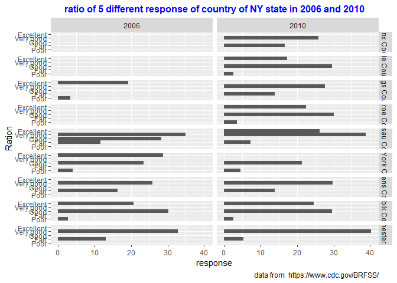

HW3\_WW1234
================
Jason Wang
10/4/2019

# Problem 1

``` r
#check the data
head(instacart, 10)
```

    ## # A tibble: 10 x 15
    ##    order_id product_id add_to_cart_ord~ reordered user_id eval_set
    ##       <int>      <int>            <int>     <int>   <int> <chr>   
    ##  1        1      49302                1         1  112108 train   
    ##  2        1      11109                2         1  112108 train   
    ##  3        1      10246                3         0  112108 train   
    ##  4        1      49683                4         0  112108 train   
    ##  5        1      43633                5         1  112108 train   
    ##  6        1      13176                6         0  112108 train   
    ##  7        1      47209                7         0  112108 train   
    ##  8        1      22035                8         1  112108 train   
    ##  9       36      39612                1         0   79431 train   
    ## 10       36      19660                2         1   79431 train   
    ## # ... with 9 more variables: order_number <int>, order_dow <int>,
    ## #   order_hour_of_day <int>, days_since_prior_order <int>,
    ## #   product_name <chr>, aisle_id <int>, department_id <int>, aisle <chr>,
    ## #   department <chr>

``` r
summary(instacart)
```

    ##     order_id         product_id    add_to_cart_order   reordered     
    ##  Min.   :      1   Min.   :    1   Min.   : 1.000    Min.   :0.0000  
    ##  1st Qu.: 843370   1st Qu.:13380   1st Qu.: 3.000    1st Qu.:0.0000  
    ##  Median :1701880   Median :25298   Median : 7.000    Median :1.0000  
    ##  Mean   :1706298   Mean   :25556   Mean   : 8.758    Mean   :0.5986  
    ##  3rd Qu.:2568023   3rd Qu.:37940   3rd Qu.:12.000    3rd Qu.:1.0000  
    ##  Max.   :3421070   Max.   :49688   Max.   :80.000    Max.   :1.0000  
    ##     user_id         eval_set          order_number      order_dow    
    ##  Min.   :     1   Length:1384617     Min.   :  4.00   Min.   :0.000  
    ##  1st Qu.: 51732   Class :character   1st Qu.:  6.00   1st Qu.:1.000  
    ##  Median :102933   Mode  :character   Median : 11.00   Median :3.000  
    ##  Mean   :103113                      Mean   : 17.09   Mean   :2.701  
    ##  3rd Qu.:154959                      3rd Qu.: 21.00   3rd Qu.:5.000  
    ##  Max.   :206209                      Max.   :100.00   Max.   :6.000  
    ##  order_hour_of_day days_since_prior_order product_name      
    ##  Min.   : 0.00     Min.   : 0.00          Length:1384617    
    ##  1st Qu.:10.00     1st Qu.: 7.00          Class :character  
    ##  Median :14.00     Median :15.00          Mode  :character  
    ##  Mean   :13.58     Mean   :17.07                            
    ##  3rd Qu.:17.00     3rd Qu.:30.00                            
    ##  Max.   :23.00     Max.   :30.00                            
    ##     aisle_id     department_id      aisle            department       
    ##  Min.   :  1.0   Min.   : 1.00   Length:1384617     Length:1384617    
    ##  1st Qu.: 31.0   1st Qu.: 4.00   Class :character   Class :character  
    ##  Median : 83.0   Median : 8.00   Mode  :character   Mode  :character  
    ##  Mean   : 71.3   Mean   : 9.84                                        
    ##  3rd Qu.:107.0   3rd Qu.:16.00                                        
    ##  Max.   :134.0   Max.   :21.00

``` r
object.size(instacart)
```

    ## 108695344 bytes

``` r
#count the number of aisle_id
instacart %>% 
  janitor::clean_names() %>%               ##clean the data
  group_by(aisle_id) %>%                   ##according aisle_id to group
  summarize(aisle_count = n()) %>%         ##count the aisle id appear time
  arrange(desc(aisle_count))               ##according the aisle_cout from large to small
```

    ## # A tibble: 134 x 2
    ##    aisle_id aisle_count
    ##       <int>       <int>
    ##  1       83      150609
    ##  2       24      150473
    ##  3      123       78493
    ##  4      120       55240
    ##  5       21       41699
    ##  6      115       36617
    ##  7       84       32644
    ##  8      107       31269
    ##  9       91       26240
    ## 10      112       23635
    ## # ... with 124 more rows

There are 134 aisle here and aisle id 83 is most ordered and times is
150609

``` r
#plot show the number of items ordered in each aisle
instacart %>% 
  janitor::clean_names() %>%                        ##clean the data
  group_by(aisle_id) %>%                            ##according aisle_id to group
  summarize(product_total_order = n()) %>%          ##count the aisle id appear time
  filter(product_total_order >= 10000) %>%          ##according the aisle_cout from large to small
  ggplot(aes(x = aisle_id, y = product_total_order)) +
  geom_point(size = 5, color = "red") +
  labs(
    title = "number of productions ordered from each aisle",
    x = "number of productions ordered",
    y = "aisle identification",
    caption = "data from  https://www.instacart.com/datasets/grocery-shopping-2017"
  ) +
  theme(
    plot.title = element_text(hjust = 0.5, size = 20, face = "bold", color = "blue")
  )
```

<!-- -->

``` r
##setup aisle filter factor 
aisle_filter_factor = c("baking ingredients", "dog food care", "packaged vegetables fruits")

top3_product <- instacart %>% 
  group_by(aisle, product_name) %>% 
  summarize(
    product_order_times = n()
  ) %>% 
  filter(aisle %in% aisle_filter_factor) %>% 
  arrange(desc(product_order_times)) %>% 
  group_by(aisle) %>% 
  slice(1:3)

knitr::kable(top3_product, align=c(rep('c',times=3)), caption = "top3 popular production in 3 aisles")
```

|           aisle            |                 product\_name                 | product\_order\_times |
| :------------------------: | :-------------------------------------------: | :-------------------: |
|     baking ingredients     |               Light Brown Sugar               |          499          |
|     baking ingredients     |               Pure Baking Soda                |          387          |
|     baking ingredients     |                  Cane Sugar                   |          336          |
|       dog food care        | Snack Sticks Chicken & Rice Recipe Dog Treats |          30           |
|       dog food care        |      Organix Chicken & Brown Rice Recipe      |          28           |
|       dog food care        |              Small Dog Biscuits               |          26           |
| packaged vegetables fruits |             Organic Baby Spinach              |         9784          |
| packaged vegetables fruits |              Organic Raspberries              |         5546          |
| packaged vegetables fruits |              Organic Blueberries              |         4966          |

top3 popular production in 3 aisles

``` r
##setup filter factor with "Pink Lady Apples" and "Coffee Ice Cream"
product_name_filter = c("Pink Lady Apples", "Coffee Ice Cream")

##filter the product name with product_name_filter
mean_ordered_time <- instacart %>% 
  select(order_dow, order_hour_of_day, product_name) %>% 
  filter(product_name %in% product_name_filter) %>% 
  group_by(order_dow, product_name) %>% 
  summarize(
    mean_order_hour = round(mean(order_hour_of_day), digits = 0)
    ) %>% 
  pivot_wider(
    names_from = "product_name",
    values_from = "mean_order_hour"
  ) %>% 
  mutate(day_of_week = wday(order_dow + 1, label = TRUE)) %>% 
  janitor::clean_names() %>% 
  select(day_of_week, coffee_ice_cream, pink_lady_apples, order_dow) %>% 
  pivot_longer(
    coffee_ice_cream:pink_lady_apples,
    names_to = "production_name",
    values_to = "mean_order_time"
  ) %>% 
  as.tibble() 
```

    ## Warning: `as.tibble()` is deprecated, use `as_tibble()` (but mind the new semantics).
    ## This warning is displayed once per session.

``` r
mean_ordered_time_dataset <- mean_ordered_time %>% 
  select(day_of_week, production_name, mean_order_time) %>% 
  pivot_wider(
    names_from = "day_of_week",
    values_from = "mean_order_time"
  ) 

knitr::kable(mean_ordered_time_dataset, align=c(rep('c',times=8)), caption = "mean order time of two productions at weekday")
```

|  production\_name  | Sun | Mon | Tue | Wed | Thu | Fri | Sat |
| :----------------: | :-: | :-: | :-: | :-: | :-: | :-: | :-: |
| coffee\_ice\_cream | 14  | 14  | 15  | 15  | 15  | 12  | 14  |
| pink\_lady\_apples | 13  | 11  | 12  | 14  | 12  | 13  | 12  |

mean order time of two productions at weekday

# Problem 2

``` r
#setup Health status filter factor
health_factor <- c("Excellent", "Very good",  "Good", "Fair", "Poor")

brfss_dataset = brfss_smart2010 %>%                         ##upload original dataset
  janitor::clean_names() %>%                                ##clean the dataset
  filter(topic == "Overall Health") %>%                     ##select the topic with "Overall Health"
  filter(response %in% health_factor)                       ##select the response value with "poor", "Fair", "good" and 

brfss_dataset$response <-  factor(brfss_dataset$response, 
                       levels =  c("Poor", 
                                   "Fair", 
                                   "Good", 
                                   "Very good", 
                                   "Excellent"))           ##modify variable response from charater to factor, and the same time change the order of observation value 

brfss_dataset = brfss_dataset[order(brfss_dataset$response, decreasing = FALSE), ]  ##ordered response from "Poor" to "Excellent"
```

``` r
##in 2002, which state were observed more than 7 locations
location_observed_2002 = brfss_dataset %>% 
  select(year, locationabbr, locationdesc) %>% 
  group_by(year, locationabbr) %>% 
  summarize(
    desc_total = n()
  ) %>% 
  filter(year == 2002, desc_total >= 7) 

knitr::kable(location_observed_2002, align=c(rep('c',times=3)),
             caption = "states were observed more than 7 locations in 2002")
```

| year | locationabbr | desc\_total |
| :--: | :----------: | :---------: |
| 2002 |      AZ      |     10      |
| 2002 |      CO      |     20      |
| 2002 |      CT      |     35      |
| 2002 |      DE      |     15      |
| 2002 |      FL      |     35      |
| 2002 |      GA      |     15      |
| 2002 |      HI      |     20      |
| 2002 |      ID      |     10      |
| 2002 |      IL      |     15      |
| 2002 |      IN      |     10      |
| 2002 |      KS      |     15      |
| 2002 |      LA      |     15      |
| 2002 |      MA      |     40      |
| 2002 |      MD      |     30      |
| 2002 |      ME      |     10      |
| 2002 |      MI      |     20      |
| 2002 |      MN      |     20      |
| 2002 |      MO      |     10      |
| 2002 |      NC      |     35      |
| 2002 |      NE      |     15      |
| 2002 |      NH      |     25      |
| 2002 |      NJ      |     40      |
| 2002 |      NV      |     10      |
| 2002 |      NY      |     25      |
| 2002 |      OH      |     20      |
| 2002 |      OK      |     15      |
| 2002 |      OR      |     15      |
| 2002 |      PA      |     50      |
| 2002 |      RI      |     20      |
| 2002 |      SC      |     15      |
| 2002 |      SD      |     10      |
| 2002 |      TN      |     10      |
| 2002 |      TX      |     10      |
| 2002 |      UT      |     25      |
| 2002 |      VT      |     15      |
| 2002 |      WA      |     20      |

states were observed more than 7 locations in 2002

``` r
##summary the location_observed_2002
count(location_observed_2002)
```

    ## # A tibble: 1 x 2
    ## # Groups:   year [1]
    ##    year     n
    ##   <int> <int>
    ## 1  2002    36

``` r
summary(location_observed_2002)
```

    ##       year      locationabbr         desc_total   
    ##  Min.   :2002   Length:36          Min.   :10.00  
    ##  1st Qu.:2002   Class :character   1st Qu.:13.75  
    ##  Median :2002   Mode  :character   Median :15.00  
    ##  Mean   :2002                      Mean   :20.00  
    ##  3rd Qu.:2002                      3rd Qu.:25.00  
    ##  Max.   :2002                      Max.   :50.00

``` r
##in 2010, which state were observed more than 7 locations
location_observed_2010 = brfss_dataset %>% 
  select(year, locationabbr, locationdesc) %>% 
  group_by(year, locationabbr) %>% 
  summarize(
    desc_total = n()
  ) %>% 
  filter(year == 2010, desc_total >= 7)

knitr::kable(location_observed_2010, align=c(rep('c',times=3)), 
             caption = "states were observed more than 7 locations in 2010")
```

| year | locationabbr | desc\_total |
| :--: | :----------: | :---------: |
| 2010 |      AL      |     15      |
| 2010 |      AR      |     15      |
| 2010 |      AZ      |     15      |
| 2010 |      CA      |     60      |
| 2010 |      CO      |     35      |
| 2010 |      CT      |     25      |
| 2010 |      DE      |     15      |
| 2010 |      FL      |     205     |
| 2010 |      GA      |     20      |
| 2010 |      HI      |     20      |
| 2010 |      IA      |     10      |
| 2010 |      ID      |     30      |
| 2010 |      IL      |     10      |
| 2010 |      IN      |     15      |
| 2010 |      KS      |     20      |
| 2010 |      LA      |     25      |
| 2010 |      MA      |     45      |
| 2010 |      MD      |     60      |
| 2010 |      ME      |     30      |
| 2010 |      MI      |     20      |
| 2010 |      MN      |     25      |
| 2010 |      MO      |     15      |
| 2010 |      MS      |     10      |
| 2010 |      MT      |     15      |
| 2010 |      NC      |     60      |
| 2010 |      ND      |     15      |
| 2010 |      NE      |     50      |
| 2010 |      NH      |     25      |
| 2010 |      NJ      |     95      |
| 2010 |      NM      |     30      |
| 2010 |      NV      |     10      |
| 2010 |      NY      |     45      |
| 2010 |      OH      |     40      |
| 2010 |      OK      |     15      |
| 2010 |      OR      |     20      |
| 2010 |      PA      |     35      |
| 2010 |      RI      |     25      |
| 2010 |      SC      |     35      |
| 2010 |      SD      |     10      |
| 2010 |      TN      |     25      |
| 2010 |      TX      |     80      |
| 2010 |      UT      |     30      |
| 2010 |      VT      |     30      |
| 2010 |      WA      |     50      |
| 2010 |      WY      |     10      |

states were observed more than 7 locations in 2010

``` r
##summary the location_observed_2010
count(location_observed_2010)
```

    ## # A tibble: 1 x 2
    ## # Groups:   year [1]
    ##    year     n
    ##   <int> <int>
    ## 1  2010    45

``` r
summary(location_observed_2010)
```

    ##       year      locationabbr         desc_total    
    ##  Min.   :2010   Length:45          Min.   : 10.00  
    ##  1st Qu.:2010   Class :character   1st Qu.: 15.00  
    ##  Median :2010   Mode  :character   Median : 25.00  
    ##  Mean   :2010                      Mean   : 33.11  
    ##  3rd Qu.:2010                      3rd Qu.: 35.00  
    ##  Max.   :2010                      Max.   :205.00

``` r
##upload excellent response
excel_resp_dataset = brfss_dataset %>% 
  filter(response == "Excellent") %>% 
  select(year, locationabbr, data_value) %>% 
  group_by(year, locationabbr) %>% 
  summarize(
    mean_data_value = mean(data_value, na.rm = TRUE)
  ) 

ggplot(excel_resp_dataset, aes(x = year, y = mean_data_value)) + 
  geom_line(aes(group = locationabbr), color = "blue") + 
  geom_point(aes(color = locationabbr)) +
  labs(
    title = "Mead data value in different states in year 2002~2010",
    x = "Year",
    y = "aisle identification",
    caption = "data from  https://www.instacart.com/datasets/grocery-shopping-2017"
  ) +
  theme(
    plot.title = element_text(hjust = 0.5, size = 15, face = "bold", color = "blue")
  )
```

<!-- -->

``` r
## 2006 and 2010 data_value distribution of "poor", ", "Fair", "Good", "Very good", "Excellent"

data_value_NY_2006_and_2010 = brfss_dataset %>% 
  filter(locationabbr == "NY") %>% 
  filter(year == c("2006", "2010")) %>% 
  group_by(locationdesc) 
```

    ## Warning in year == c("2006", "2010"): longer object length is not a
    ## multiple of shorter object length

``` r
data_value_NY_2006_and_2010$locationdesc = sapply(strsplit(
  data_value_NY_2006_and_2010$locationdesc, 
  split = "-", 
  fixed=TRUE), function(x) (x[2]))

ggplot(data_value_NY_2006_and_2010, aes(x = response, y = data_value)) +
  geom_col() +
  facet_grid(locationdesc~year) +
  labs(
    title = "ratio of 5 different response of country of NY state in 2006 and 2010",
    x = "Ration",
    y = "response",
    caption = "data from  https://www.cdc.gov/BRFSS/"
  ) +
  theme(
    plot.title = element_text(hjust = 0.5, size = 12, face = "bold", color = "blue")
  ) +
  coord_flip()
```

<!-- -->

# Problem 3

``` r
accelerometers_dataset = read_csv(file = "./data/accel_data.csv") %>%         ##upload the dataset
  janitor::clean_names() %>%                                                  ##clean the dataset
mutate(
    weekday_or_weekend = case_when(
      day == "Monday"     ~ "weekday",
      day == "Tuesday"    ~ "weekday",
      day == "Wednesday"  ~ "weekday",
      day == "Thursday"   ~ "weekday",
      day == "Friday"     ~ "weekday",
      day == "Saturday"   ~ "weekend",
      day == "Sunday"     ~ "weekend",
      TRUE                ~ "NA"
    )
  ) %>%                                                                       ##add a new viariable weekday_or_weekend
  pivot_longer(
  activity_1:activity_1440,
  names_to = "minutes",
  values_to = "measured_value",
  names_prefix = "activity_"
)                                                                             ##
```

    ## Parsed with column specification:
    ## cols(
    ##   .default = col_double(),
    ##   day = col_character()
    ## )

    ## See spec(...) for full column specifications.

``` r
accelerometers_dataset$minutes = as.integer(accelerometers_dataset$minutes)   ##convert the viariable minutes from chr to int

##summary the data
str(accelerometers_dataset)
```

    ## Classes 'tbl_df', 'tbl' and 'data.frame':    50400 obs. of  6 variables:
    ##  $ week              : num  1 1 1 1 1 1 1 1 1 1 ...
    ##  $ day_id            : num  1 1 1 1 1 1 1 1 1 1 ...
    ##  $ day               : chr  "Friday" "Friday" "Friday" "Friday" ...
    ##  $ weekday_or_weekend: chr  "weekday" "weekday" "weekday" "weekday" ...
    ##  $ minutes           : int  1 2 3 4 5 6 7 8 9 10 ...
    ##  $ measured_value    : num  88.4 82.2 64.4 70 75 ...

``` r
head(accelerometers_dataset, 10)
```

    ## # A tibble: 10 x 6
    ##     week day_id day    weekday_or_weekend minutes measured_value
    ##    <dbl>  <dbl> <chr>  <chr>                <int>          <dbl>
    ##  1     1      1 Friday weekday                  1           88.4
    ##  2     1      1 Friday weekday                  2           82.2
    ##  3     1      1 Friday weekday                  3           64.4
    ##  4     1      1 Friday weekday                  4           70.0
    ##  5     1      1 Friday weekday                  5           75.0
    ##  6     1      1 Friday weekday                  6           66.3
    ##  7     1      1 Friday weekday                  7           53.8
    ##  8     1      1 Friday weekday                  8           47.8
    ##  9     1      1 Friday weekday                  9           55.5
    ## 10     1      1 Friday weekday                 10           43.0

``` r
summary(accelerometers_dataset)
```

    ##       week       day_id       day            weekday_or_weekend
    ##  Min.   :1   Min.   : 1   Length:50400       Length:50400      
    ##  1st Qu.:2   1st Qu.: 9   Class :character   Class :character  
    ##  Median :3   Median :18   Mode  :character   Mode  :character  
    ##  Mean   :3   Mean   :18                                        
    ##  3rd Qu.:4   3rd Qu.:27                                        
    ##  Max.   :5   Max.   :35                                        
    ##     minutes       measured_value
    ##  Min.   :   1.0   Min.   :   1  
    ##  1st Qu.: 360.8   1st Qu.:   1  
    ##  Median : 720.5   Median :  74  
    ##  Mean   : 720.5   Mean   : 267  
    ##  3rd Qu.:1080.2   3rd Qu.: 364  
    ##  Max.   :1440.0   Max.   :8982

``` r
##convert the week and day_id to chr
##accelerometers_dataset$week = as.character(accelerometers_dataset$week)
##accelerometers_dataset$day_id = as.character(accelerometers_dataset$day_id)

##total activity of every day
accem_day_dataset = accelerometers_dataset %>% 
  group_by(week, day_id) %>% 
 summarize(
   total_activity = sum(measured_value)
 ) 

knitr::kable(accem_day_dataset, align=c(rep('c',times=3)), caption = "Accelerometers total measured activity for each day")
```

| week | day\_id | total\_activity |
| :--: | :-----: | :-------------: |
|  1   |    1    |    480542.62    |
|  1   |    2    |    78828.07     |
|  1   |    3    |    376254.00    |
|  1   |    4    |    631105.00    |
|  1   |    5    |    355923.64    |
|  1   |    6    |    307094.24    |
|  1   |    7    |    340115.01    |
|  2   |    8    |    568839.00    |
|  2   |    9    |    295431.00    |
|  2   |   10    |    607175.00    |
|  2   |   11    |    422018.00    |
|  2   |   12    |    474048.00    |
|  2   |   13    |    423245.00    |
|  2   |   14    |    440962.00    |
|  3   |   15    |    467420.00    |
|  3   |   16    |    685910.00    |
|  3   |   17    |    382928.00    |
|  3   |   18    |    467052.00    |
|  3   |   19    |    371230.00    |
|  3   |   20    |    381507.00    |
|  3   |   21    |    468869.00    |
|  4   |   22    |    154049.00    |
|  4   |   23    |    409450.00    |
|  4   |   24    |     1440.00     |
|  4   |   25    |    260617.00    |
|  4   |   26    |    340291.00    |
|  4   |   27    |    319568.00    |
|  4   |   28    |    434460.00    |
|  5   |   29    |    620860.00    |
|  5   |   30    |    389080.00    |
|  5   |   31    |     1440.00     |
|  5   |   32    |    138421.00    |
|  5   |   33    |    549658.00    |
|  5   |   34    |    367824.00    |
|  5   |   35    |    445366.00    |

Accelerometers total measured activity for each day

``` r
accem_day_dataset %>% 
  ggplot(aes(x = day_id, y = total_activity, group = week, color = week)) +
  geom_line() +
  labs(
    title = "ratio of 5 different response of country of NY state in 2006 and 2010",
    x = "Ration",
    y = "response",
    caption = "data from  https://www.cdc.gov/BRFSS/"
  ) +
  theme(
    plot.title = element_text(hjust = 0.5, size = 12, face = "bold", color = "blue")
  )
```

<!-- -->

``` r
accelerometers_dataset %>% 
  ggplot(aes(x = minutes, y = measured_value, group = day_id, color = week)) +
  geom_line() +
  facet_grid(week~.)
```

<!-- -->
